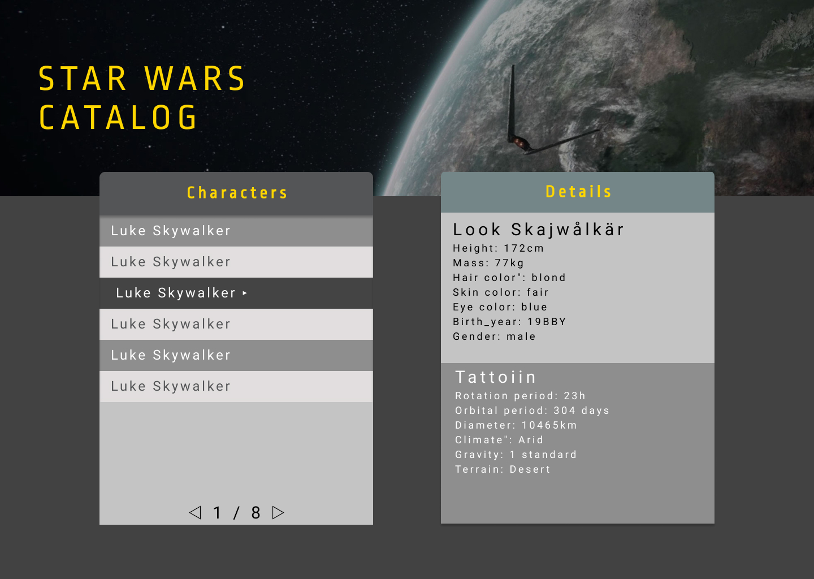

# Super SWAPI Webster interface 1.0
**Deadline**: 2a Februari 17:00.

Registrera dig i en grupp via omnius.


Syftet med denna uppgift är att ge studerande en möjlighet att visa att denne besitter förmågan att självständigt implementera en API-fråge-lösning med hjälp av något javascript ramverk (eller likartat bibliotek). Bedömningen sker via inspelade videopresentationer, **se bedömning längre ner** samt inlämnad uppgift enligt betygskriterierna.

## Uppgift

SWAPI dev (https://swapi.dev/) är ett öppet API som tillåter en att med GET förfrågningar hämta information om entiteter från star wars franchise. I denna uppgift så ska du implementera en webbgränssnittslösning där du kan navigera informationen för dessa entiteter.

Skapa ett gränssnitt där användaren kan välja på de 6 kategorierna som finns tillgängliga under SWAPI api:et. Dessa är synliga under addressen https://swapi.dev/api/

```json
{
	"people": "https://swapi.dev/api/people/",
	"planets": "https://swapi.dev/api/planets/",
	"films": "https://swapi.dev/api/films/",
	"species": "https://swapi.dev/api/species/",
	"vehicles": "https://swapi.dev/api/vehicles/",
	"starships": "https://swapi.dev/api/starships/"
}
```

Exempel på entitetsutdrag från https://swapi.dev/api/films/2 med egenskaperna *"title, episode_id, opening_crawl, director, producer och release_date"*. <br>

*"characters, planets, starships, vehicles och species"* är länkar till andra entiteter.
```json
{
	"title": "The Empire Strikes Back",
	"episode_id": 5,
	"opening_crawl": "It is a dark time for the\r\nRebellion. ...  far reaches of space....",
	"director": "Irvin Kershner",
	"producer": "Gary Kurtz, Rick McCallum",
	"release_date": "1980-05-17",
	"characters": [
		"https://swapi.dev/api/people/1/",
    ...
		"https://swapi.dev/api/people/26/"
	],
	"planets": [
		"https://swapi.dev/api/planets/4/",
    ...
		"https://swapi.dev/api/planets/27/"
	],
	"starships": [
		"https://swapi.dev/api/starships/3/",
    ...
		"https://swapi.dev/api/starships/23/"
	],
	"vehicles": [
		"https://swapi.dev/api/vehicles/8/",
    ...
		"https://swapi.dev/api/vehicles/20/"
	],
	"species": [
		"https://swapi.dev/api/species/1/",
    ...
		"https://swapi.dev/api/species/7/"
	],
	"created": "2014-12-12T11:26:24.656000Z",
	"edited": "2014-12-15T13:07:53.386000Z",
	"url": "https://swapi.dev/api/films/2/"
}
```

För godkänt så fungerar det att placera varje sida som en undersida i gränssnittet. För ett högre betyg så ska samtliga länkar finnas under samma sida där innehållet ersätts beroende på användarens val.


## Design

Design är valfri men feedback på skissdesign kan erhållas av handledare. Det viktiga är att respektive kategori i api:et motsvarar de egenskaper som hämtas från api:et för respektive kategori. Ett exempel med en konceptuell design, taget från en kollegas övning, med API:et ser ut som följande:


Observera att detta endast är en mockup och att gränssnittet kräver justeringar för att uppfylla kraven.

## Bedömning

Innan deadline ska en individuell videopresentation skickas in via omnius. Videon måste uppfylla följande tekniska krav:
1. Studerande måste vara synlig i minst 15 sekunder under videoinspelningen.
2. Videon får **inte** överstiga 4 minuter och 30 sekunder (350 sekunder totalt).
3. Ljudkvaliteten ska vara accepterbar och det ska gå att höra den inspelades röst under hela inspelningen.
   
Följande ska presenteras under inspelningen.
### Introduktion (under 1 minut)
- Namn på individ
- Kort redovisning för hur projektet fördelades under arbetet.
  
### Användargränssnittet (under 1 minut)
- Visa fungerande navigering av kategorierna.
- Visa eventuellt implementerade sökfunktioner

### Koddemo (1-2 minuter)
Förklara med koden hur det valda ramverket användes för att lösa uppgiften. Betoning på fördelar och nackdelar i ramverket. Du bedöms med hänsyn till förmåga att använda och förstå ramverket, **inte* hur "snygg" koden är.

**Observera** 
```
Som hyfsat kompetent inom kodläsning så är jag *inte* intresserad av vad varje rad kod gör. Det jag vill att *du* redovisar är varför koden är skriven som den är skriven. 
Vad för problem löste komponenten? Varför valdes en synkronisk lösning framför en asynkronisk lösning? Vad skulle behöva ändras i koden för att lägga till ytterligare kategorier, egenskaper eller annat som kan tänkas förändras i Super SWAPI Webster interface 2.0? ....
```

### Sammanfattning (ca 1 minut)
Avsluta med en kortare sammanfattning över vad som var bra respektive dåligt med ramverket (vilka problem respektive nya problem som ramverket löste/orsakade, möjligheter m.m.). Redovisa även vilka utmaningar som uppstod då ni arbetade med API:et och hur ni löste dessa.

## Inlämning
Via omnius skicka in följande
- Videoinspelning
- Länk till github repo med fullständig källkod

### Betygskriterier
För samtliga nivåer är det tillåtet att använda valfritt medel för att hämta data från api:et. Det enda undantaget är de s.k. “SWAPI Helper libraries”, dessa är ej tillåtna. Vidare är även valet av ramverk (eller komponent orienterat bibliotek såsom React) valfritt.

#### Godkänt
För betyget godkänt ska det implementeras en hemsida med hjälp av ett ramverk där det går att navigera kategorierna people, planets, films, species, vehicles och starships med tillhörande egenskaper för respektive entitet. Samtliga data ska inhämtas asynkront via SWAPI API:et.

#### Väl godkänt
För betyget väl godkänt ska samtliga krav för godkänt vara uppfyllda. Sidan ska vidare implementeras som en SPA (single page application, se respektive ramverks dokumentation). Det ska även finns ett sökfält där användaren kan söka efter någon entitet under vald/samtliga kategori(er).


### Återkoppling

Sker via ominus senast 3 veckor efter avslutad kurs i samband med kursbetyget.


--- 
<small>Varför inte börja med en kopp kaffe? </small> :coffee:
